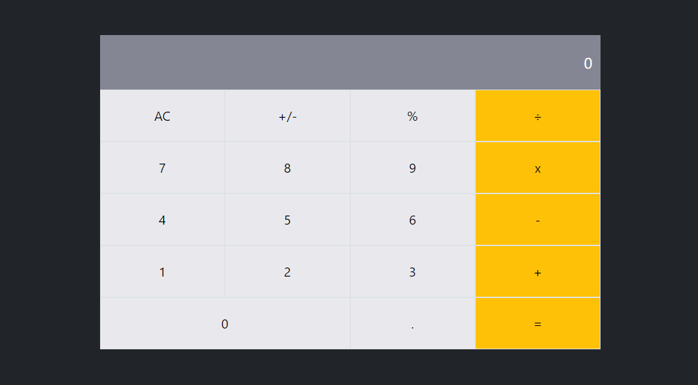

# Mathix

> A React app to do simple math and display inspiring quotes.

Mathix is a website for all fans of mathematics built with React.  It allows for simple calculations and read random math-related quotes.

## Live demo

https://meltrust.github.io/mathix/

## Made with

- Javascript
- Webpack
- React
- CSS3
- HTML5

## Future Updates & Roadmap

- More general styling.

## Getting Started

To get a local copy up and running follow these simple example steps:

1. Under the repository name, click the Clone or download green button.

2.Copy the URL given by clicking the clipboard button

3.Open a terminal window in your local machine and change the current directory to the one you want the clone directory to be made.

4.Type  git clone and the paste the URL you previusly copied to the clipboard

5.Change the current directory to the newly created folder

6.Open the index.html file on your browser. You can add and remove books which persist on browser reloads.

7.In your terminal, `npm install` to install the dependencies.

8.Now run `npm start` and the app should appear on your browser.

## Author

👤 **Miguel Tapia**

- Github: [@meltrust](https://github.com/meltrust)
- Linkedin: [linkedin](https://www.linkedin.com/in/meltrust/)
- Or talk to me directly at: original.mtapia@outlook.com

## 🤝 Contributing

Contributions, issues and feature requests are welcome!

Feel free to check the [issues page](issues/).

## Show your support

Give a ⭐️ if you like this project!

## Acknowledgments

- Hat tip to anyone whose code was used
- Inspiration
- etc

## 📝 License

This project is [MIT](lic.url) licensed.

